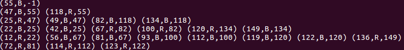
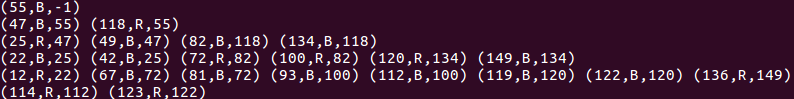
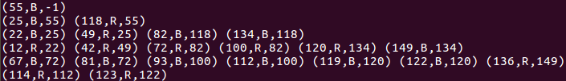
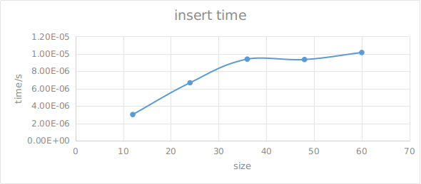

### pro3 report
#### 1.实验要求：
1. 实现红黑树的基本算法， 对n的取值分别为 12、24、36、48、60，随机生成n 个互异的正整数（K1, K2, K3, ……, Kn）作为节点的关键字，向一棵初始空的红黑树中依次插入这n 个节点，统计算法运行所需时间 ，画出时间曲线。（红黑树采用三叉链表）
2. 对上述生成的红黑树，找出树中的第n/3小的节点和第n/4小的节点，并删除这两个节点，统计算法运行所需时间 ， 画出时间曲线。

#### 2.实验环境：
1. ubuntu 16.04
2. gcc 5.4.0/clang 4.0.1
3. memory:16GB
4. 主频：1.7GHz

#### 3.实验过程：
代码分为四个部分，分别为`rbtree`类，`readfile`文件读取，`select`利用线性时间的算法测试删除结点是否正确，以及生成不同的随机数的`random`,位于`input/`文件夹。下面分别介绍各个部分。
1. 首先是随机数生成模块，为得到互不相同的随机数，需要对生成的随机数进行筛选.在本次实验中，共产生了120个随机数，随机数的范围是[1,150],首先定义一个长度为151的数组，其取值依次为1-151,对产生的随机数做`mod`运算，得到的数在[1,150],若该数字未出现过，则将其值读入文件，并将数组值赋予`0`，说明该值已经出现过，具体代码如下
>```
> for(int i=0;i<lenth;i++){
    iptr[i]=i+1;
}
for(int i=0;i<SIZE;)
{
  int buffer =rand()%(MAX-MIN+1)+MIN;
  if(iptr[buffer]!=0){
      filewriter<<iptr[buffer]<<endl;
      i++;
      iptr[buffer]=0;
  }
}
> ```
> 如需检查，在`bash`输入`c++ random.cpp -o random -std=c++11`,
> 得到可执行文件，默认的文件路径为`./input.txt`
2. `readfile`文件读取，复用上一次实验的源代码，稍作修改，仍然是每次读取一行，不予赘述。
3. `select`采用课本上的算法，与之不同的在于`partition`函数并未随机选择分割点，不影响结果的正确性，代码如下
```
std::vector<int>::iterator select(std::vector<int>&vec,int p,int r,int i){
    if(p==r){
        return vec.begin()+p;
    }
    int q=partition(vec,p,r);
    int k=q-p+1;
    if(i==k){
        return vec.begin()+q;
    }
    else if(i<k)
        return select(vec,p,q-1,i);
    else return select(vec,q+1,r,i-k);
}
```
4. `rbtree`，该部分封装成一个类，需要的功能已经实现，具体的方法以及说明见于`rbtree.h`.

#### 4.实验关键代码以及截图
1. 关键代码`deletefixup`
```
void RBTree::deletefixup(RBNode*ptrx){
    // if(ptrx==ptrx->parent->right){
    //     std::cout<<"right"<<std::endl;
    //     exit(-1);
    // }
    //
    while(ptrx!=this->root&&ptrx->color==BLACK){
        if(ptrx==ptrx->parent->left){
            // std::cout<<"left"<<std::endl;
            // if(this->nil->parent==nullptr){
            //     std::cout<<"true"<<std::endl;
            // }
            RBNode* ptrw=ptrx->parent->right;
            // std::cout<<"ptrw:"<<ptrw->key<<std::endl;
            // std::cout<<ptrx->key<<std::endl;
            if(ptrw->color==RED){//case 1
                ptrw->color=BLACK;
                ptrx->parent->color=RED;
                leftRotate(ptrx->parent);
                ptrw=ptrx->parent->right;
            }
            if(ptrw->left->color==BLACK&&ptrw->right->color==BLACK){//case 2
                ptrw->color=RED;
                ptrx=ptrx->parent;
            }
            else if(ptrw->right->color==BLACK){//case 3
                ptrw->left->color=BLACK;
                ptrw->color=RED;
                rightRotate(ptrw);
                ptrw=ptrx->parent->right;
            }else{//case 4
                ptrw->color=ptrx->parent->color;
                ptrx->parent->color=BLACK;
                ptrw->right->color=BLACK;
                leftRotate(ptrx->parent);
                ptrx=this->root;
            }
        }
        else{
            RBNode* ptrw=ptrx->parent->left;
            if(ptrw->color==RED){//case 1
                ptrw->color=BLACK;
                ptrx->parent->color=RED;
                rightRotate(ptrx->parent);
                ptrw=ptrx->parent->left;
            }
            if(ptrw->right->color==BLACK&&ptrw->left->color==BLACK){//case 2
                ptrw->color=RED;
                ptrx=ptrx->parent;
            }
            else if(ptrw->left->color==BLACK){//case 3
                ptrw->right->color=BLACK;
                ptrw->color=RED;
                leftRotate(ptrw);
                ptrw=ptrx->parent->left;
            }else{//case 4
                ptrw->color=ptrx->parent->color;
                ptrx->parent->color=BLACK;
                ptrw->left->color=BLACK;
                rightRotate(ptrx->parent);
                ptrx=this->root;
            }
        }
    }
}
```
2. 以及`insertfixup`
```
void RBTree::insertfixup(RBNode*ptrz){
    //
    // if(ptrz->parent!=this->nil)
        while(ptrz->parent->color==RED){
            if(ptrz->parent==ptrz->parent->parent->left){
                RBNode *ptry=ptrz->parent->parent->right;
                if(ptry->color==RED){
                    ptrz->parent->color=BLACK;//case 1
                    ptry->color=BLACK;//case 1
                    ptrz->parent->parent->color=RED;//case 1
                    ptrz=ptrz->parent->parent;//case 1
                }
            else if(ptrz==ptrz->parent->right){
                    ptrz=ptrz->parent;//case 2
                    leftRotate(ptrz);//case 2
                    }
                    else{
                        ptrz->parent->color=BLACK;
                        ptrz->parent->parent->color=RED;//case 3
                        rightRotate(ptrz->parent->parent);//case 3
                    }
                }
            else{
                RBNode* ptry=ptrz->parent->parent->left;
                if(ptry->color==RED){
                    ptrz->parent->color=BLACK;//case 1
                    ptry->color=BLACK;//case 1
                    ptrz->parent->parent->color=RED;//case 1
                    ptrz=ptrz->parent->parent;//case 1
                }
            else if(ptrz==ptrz->parent->left){
                ptrz=ptrz->parent;//case 2
                rightRotate(ptrz);//case 2
                }
                else{
                    ptrz->parent->color=BLACK;
                    ptrz->parent->parent->color=RED;//case 3
                    leftRotate(ptrz->parent->parent);//case 3
                }
            }
        }
        this->root->color=BLACK;
}
```
3. 算法教材已经给出，并无实质性困难，且不要求有输出，所有的结果已经存放在相应的文本文件中。
4. 截图，按照实验要求，需要比较清楚地输出删除结点前后红黑树的结构情况，我这里按照层次输出，每个结点的格式为(key,color,parent->key),从实际效果来看，能够比较清楚地展示树的结构，由于结点过多的时候在终端中稍显拥挤，这里只展示了`size`为24时的情况，助教可以运行以查看更多情况。图片如下所示：
    1. 初始时树的结构：
    2. 删除第一个结点：
    3. 删除第二个结点：

#### 5.实验结果以及分析
输出结点采用如下格式：
`(key,color)`其中`0`for`BLACK`,`1`for`RED`.
1. insert：
    1. 性能分析，得到各个size的时间曲线如下所示：
    2. 
    3. 曲线大致符合`O(n)`的时间复杂度，注意到，在size为36的时候，花费的时间超过size为48 的时间，推测可能是因为花费的时间太小，或者是`I/O`时间造成的影响。
    4. 另外，在每个`size`，`total time`并不等于每`10`次统计时间的和，而是略小于，推测是因为在每`10`次统计的过程中，需要测量当前时间，这涉及一次赋值操作，需要访问内存，这会有额外的时间开销。
2. delete:
    1. delete 操作要求`n`是动态变化的，按照我的理解，`n`代表红黑树的`size`，于是当初始size为12时，删除一个结点，size变为11,11/4不是一个整数，我采取的向下取整的策略。
    2. 每次delete花费的时间大致相同，不应size的变化而变化，这与理论相符合。

#### 6.实验心得：
1. 实验涉及的算法课本已给出，实现它实质上并无难度，但有助于我们更好的理解.
